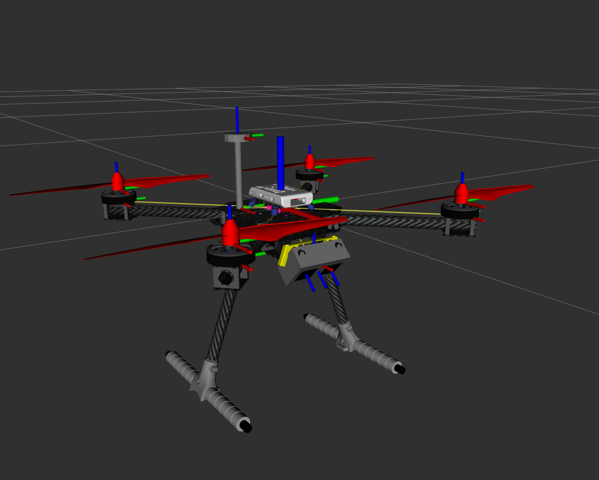
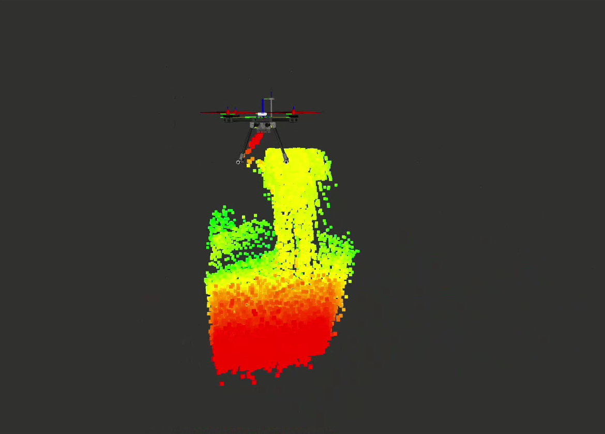

# holybro_model

## Images Overview
Below are images demonstrating the components and functionalities:

  
*holybro model in RViz*

  
*Image of LiDAR (hps3d160) functionality on holybro*

## Overview
The `holybro_model` repository contains resources and configuration files for simulating, visualizing, and interacting with a Holybro model in ROS2. It includes URDF files for the robot model, RViz configurations, launch files for various purposes, and additional assets for visualization and simulation.

---

## Directory Structure
```
.
├── CMakeLists.txt             # CMake configuration file
├── frames_*.gv                # Graphviz visualization of frames (timestamped)
├── frames_*.pdf               # PDF visualization of frames (timestamped)
├── launch/                    # Contains ROS2 launch files
├── LICENSE                    # License information
├── materials/                 # Material definitions for the model
├── meshes/                    # Mesh files used in URDF/Xacro
├── model.config               # Model configuration file
├── package.xml                # ROS2 package information
├── rviz/                      # RViz configuration files
├── sdf/                       # SDF files for simulation
├── setup.png                  # Setup diagram or image
├── thumbnails/                # Thumbnail images
├── urdf/                      # URDF files defining the robot model
├── xacro/                     # Xacro files for generating URDF
```

---

## Installation

1. Navigate to the `src` directory of your ROS2 workspace:
   ```bash
   cd holybro_ws/src
   ```

2. Clone the repository:
   ```bash
   git clone <repository-url>
   ```

3. Build the entire workspace:
   ```bash
   cd ..  # Navigate back to the workspace root
   colcon build
   source install/setup.bash
   ```

---

## Launch Files
The repository includes the following launch files:

### `holybro_model.launch.py`
Launches the Holybro model in RViz with the robot description loaded from the URDF.

#### Usage:
```bash
ros2 launch holybro_model holybro_model.launch.py
```

### `holybro_model_rosbag.launch.py`
A variation of the launch file, designed for playback with ROS bag files.

#### Usage:
```bash
ros2 launch holybro_model holybro_model_rosbag.launch.py
```

---

## Key Components

### URDF/Xacro Files
- Located in the `urdf/` and `xacro/` directories.
- Defines the structure, joints, and sensors of the robot model.

### RViz Configuration
- Located in `rviz/default.rviz`.
- Provides a default visualization setup for the Holybro model in RViz.

### Meshes and Materials
- The `meshes/` directory contains 3D model files used in URDF visualization.
- The `materials/` directory contains material definitions for enhancing visualization.

---

## Requirements
- ROS2 Humble or later
- Python 3.8+
- RViz2 for visualization

---

## Debugging
Paths to URDF and RViz configuration files are printed during launch for debugging purposes. Ensure the paths are correct and files are accessible.

---

## Contribution
Feel free to submit issues or pull requests for bug fixes, feature enhancements, or other contributions. Ensure your code adheres to the coding standards outlined in the repository.

---

## License
This repository is licensed under the terms specified in the `LICENSE` file.

---

## Acknowledgments
Thank you for using the `holybro_model` package. For further support or inquiries, please contact the maintainers listed in the `package.xml` file.


